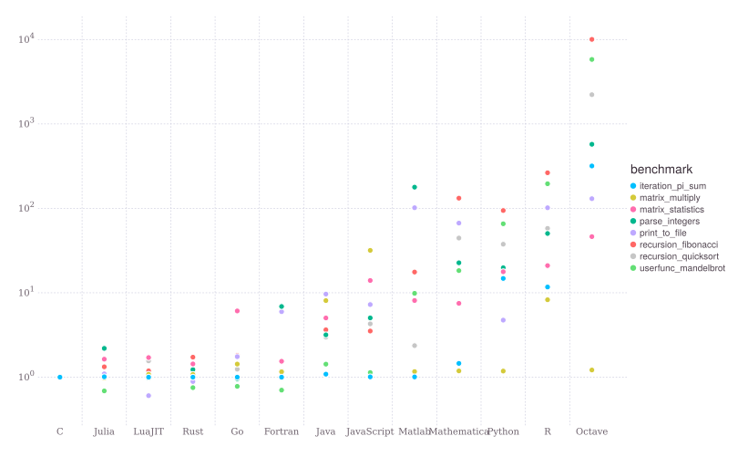

# Julia Course 2022

## Introduction
- What is Julia?
- Why use it?
- Demo of standard libraries
- Plotting
- Documentation and help

## Homepage
Course homepage
https://github.com/baggepinnen/juliacourse2022

## What is Julia?
The Julia Language: A fresh approach to technical computing.

- Dynamically typed
- "Optionally typed"
- High-level language with simple, mathematical syntax
- Multiple dispatch

- Version 0.1 Released Feb 2013
- Version 1.0 Released Aug 2018
- Latest version 1.8

## Why use Julia?
- Solves the two-language problem. From ThinkJulia.jl :
> Julia is a unique programming language because it solves
the so-called two languages problem. No other program-
ming language is needed to write high-performance code.
This does not mean it happens automatically. It is the re-
sponsability of the programmer to optimize the code that
forms a bottleneck but this can done in Julia itself.*

## Why use Julia?
- Open source and free: The whole language and all packages!
- Possible to understand what is going on, Julia is written in Julia!
- Easy to get started
- Many third party libraries (8000+, not as many as Python)
- Easy to make reproducible projects
- Fast and high level

## Why not use Julia?
#### For control
- Real-time performance
#### For industry
- Hire Julia programmers
- Deployment currently not straightforward
#### For academia
- Package ecosystem

## Fast

https://julialang.org/benchmarks/

## Today
- Install Julia and an editor
- The package manager Pkg.jl
- Stdlib
- Plotting
- Help

## Homework
Convert one of your favorite scripts to Julia

## Next week
- Types
- Functions
- Multiple dispatch