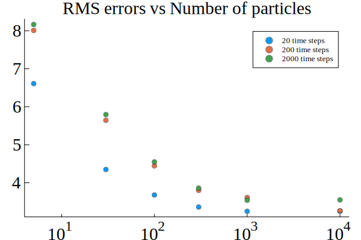

# Lecture 3 - Performance

[Lecture video](https://youtu.be/iXanjMe8OQk) (unfortunately without screen share).

## Homework

Monte-Carlo simulation of a bootstrap particle filter

This weeks homework will be a competition. The goal is to optimize the code detailed below, the winner will be the one who has provided the fastest running program (as determined by me running on my machine (AMD Ryzen 9 5900x 12-core processor, GeForce RTX 3080) that is
1. Submitted in time.
2. *Equivalent* to the original code, in the sense that it can reproduce the estimation performance demonstrated below, without fundamentally changing the particle filter algorithm or the number of particles/time-steps.

### Details

- I provide the [baseline code](https://github.com/mfalt/juliacourse/blob/master/lecture3/test_pf.jl)
- My code provides a decent particle filter implementation
- The code is bad from a julia-performance point of view
- Your job is to optimize it
- Optimized code has to be equivalent (do not implement different algorithm)
- If you get stuck, find me in my office and I'll help you out.

### Expected results
The output of the program will look something like this
```
N = 5
N = 30
N = 100
N = 300
N = 1000
N = 10000
T = 20
N = 5
N = 30
N = 100
N = 300
N = 1000
N = 10000
T = 200
N = 5
N = 30
N = 100
N = 300
N = 1000
N = 10000
T = 2000
Propagated 359755800 particles
79.731928 seconds (832.87 M allocations: 104.297 GiB, 5.69% gc time)
```
The code took approximately 80 seconds to run on my machine and produced the following result  
  
It is a good idea to continuously test your code and make sure you maintain a similar estimation performance as you modify the code.

My optimized version runs in about  
`3.593313 seconds (148 allocations: 3.944 MiB)` single threaded and
`1.273088 seconds (634 allocations: 4.035 MiB)` if I allow myself to use multiple threads. This is an approximately 22-fold reduction in running time (and a 26k-fold reduction in allocated memory). This will give you an idea of *at least* how far it is possible to push it.

*-Fredrik*
